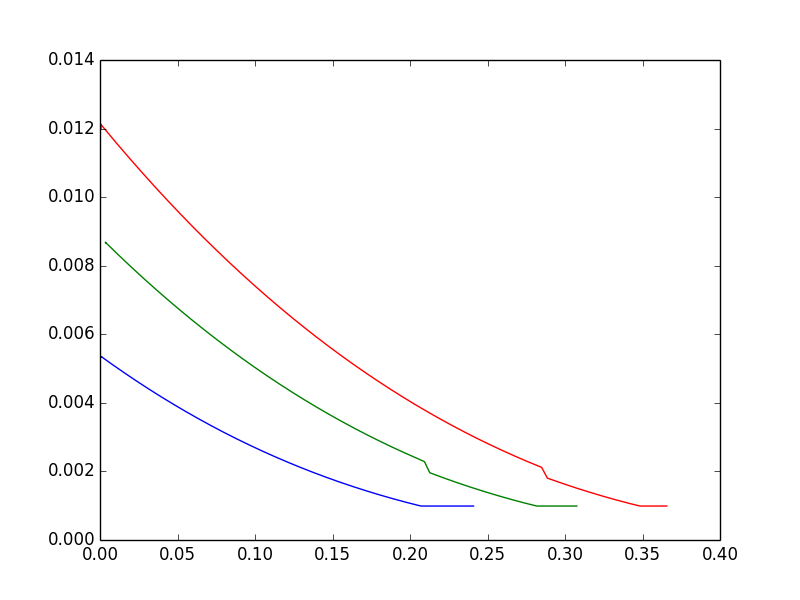
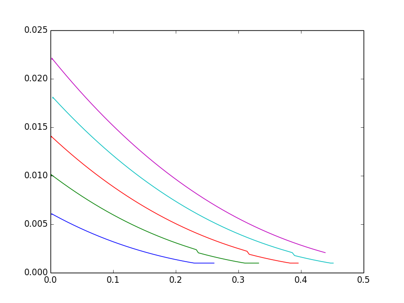
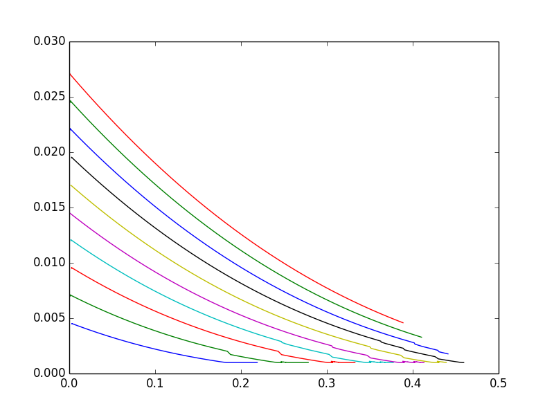

#README Mauricio Sánchez

Introducción
==============
El presente trabajo busca modelar mediante un método lagrangiano el transporte de sedimentos en canales de agua de flujo continuo, no turbulento, principalmente de arenas finas y gravas. Además, el segundo foco de este proyecto, es estudiar como influye la decisión del algoritmo a implementar, y como varía su rendimiento a medida que se le exige más al modelo.

Para la realización de este modelo se consideraron varios supuestos de tal manera que fuera valido: 
```
	1.- Se consideró que todas las particulas son identicas, y tienen un diametro de 2 mm, puesto que este diametro diferencia a las arenas finas de las gruesas.
	2.- El modelo esta pensado para particulas esféricas perfectas, sin dar a alugar a particulas no uniformes. 
	3.- Todas las particulas son identicas, pero inician sus trayectorias con posiciones y velocidades aleatorias.
	4.- Se asume que el suelo es liso, y sin coeficiente de roce. 
	5.- El flujo del canal se rige por un perfil logaritmico basado en la ley de Von Kárnmán-Prandtl.
```
Como este modelo busca predecir la trayectoria de varias particulas al mismo tiempo, se requiere de métodos de integración que retornen el comportamiento de estas, en base a las condiciones mencionadas anteriormente, los cuales se ven limitados por la cantidad de particulas, y por el tiempo en que se estudia su monvimiento.

Primero se utilizó el método de euler, el cual se ve extremadamente limitado por el tiempo de estudio, más que por el número de particulas, debido a que el sistema de iteracion es muy básico y no está tan optimizado como el método Odeint que provée Scipy.

Por su parte, Odeint, si bien funciona mucho más rápido que euler, es más complicado modelar el movimiento de las particujlas, debido a que esta función solo acepta vectores de una dimensión, por lo que se tuvo que entregar un vector con las condiciones iniciales de todas las particulas.

Rendimiento Personal
==================
En este modelo consideramos inicialmente la fuerza peso, la fuerza de boyaje y la de arrastre. Posteriormente, incluimos las fuerzas de masa virtual y la fuerza de empuje. una vez terminado el modelo procedimos a correr el programa en cada computador, en mi caso tengo un MacBook Pro, con un procesador Intel Core i5 e 2.3 GHz, con 8 Gb de RAM y en modelar 3 particulas, en un periodo de 5 segundos, se demora 1.2 segundos. 5 particulas se demora 12.1 segundos, y 10 particulas 125.1 segundos, pero solo evaluando 3 segundos; por lo que puedo concluir que a medida que se aumentan particulas el tiempo de espera aumenta exponencialmente, dando a entender que no es un método muy practico, debido a que en la realidad se trabaja con miles de particulas.

Resultados
=============






Como se puede ver en las imagenes anteriores, el comportamiento cuando aumentan las particulas, es muy similar al de un modelaminto de pocas particulas. sin embargo, este modelo no es muy representativo de la realidad, ya que son muy pocas particulas las estudiadas.

